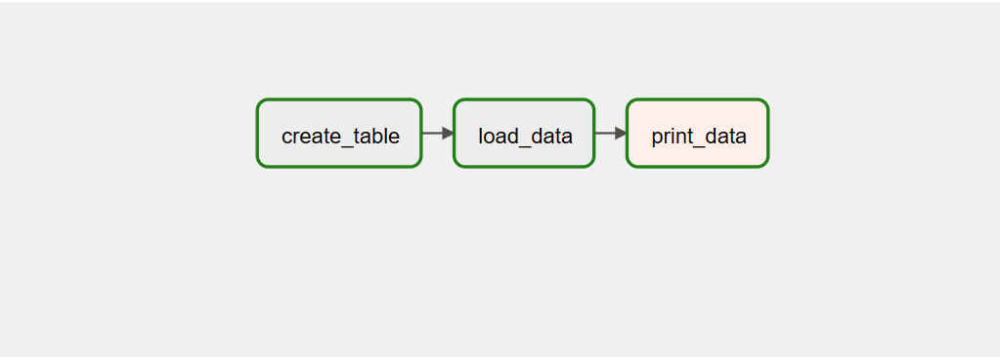

# Data Engineering
## Project description
* The objective is to make sure that we have the tools and procedures required to work successfully and efficiently as a team on this particular project. First tasks have been established as user stories in a product backlog that has been set up as a GitHub project. To monitor our progress and oversee our work, we use sprint boards in addition to a Kanban/project board. Also, we have generated the appropriate branches for the GitFlow workflow, including the master, develop, and release branches, and setup the project's initial Docker files.

* During this sprint, we have also established our code of conduct and defined the first release on GitHub. Additionally, we have focused on setting up the data pipelines and sending data to Airflow's PostgreSQL database. We have worked on defining the schema and designing the ETL process to move data from source to destination. We have also set up the necessary connections and configurations for Airflow and the PostgreSQL database.

## Data source
* We have a Python file that generates a data source in the form of a CSV file. The file creates 100 rows of data, with each row representing a person and containing the person's name, age, and country of origin. The data is generated randomly using Python's built-in random module. The code writes the data to a CSV file named "generated_data.csv". The generated data could be used for various purposes, such as testing data analysis or machine learning models.

## Architecture
The technical architecture for this project is as show below:

# Data model
* The data model for this project is as show below:

# Data Pipline
The ETL process runs through an Airlfow DAG:

The process is as follows:
1. create_table
2. load_data
3. print_data

# Team Members
* Zakariya Oulhadj
* Taylor Head
* Adam Zbikowski
* Samoil Bogdan Adascalului

# Team Roles
* [@ZOulhadj](https://github.com/ZOulhadj) - Product Owner
* [@Nero-DevOps](https://github.com/Nero-DevOps) - Scrum Master
* [@Adam](https://github.com/Frioo) - Team Leader 1
* [@archeris32](https://github.com/archeris32) - Team Leader 2